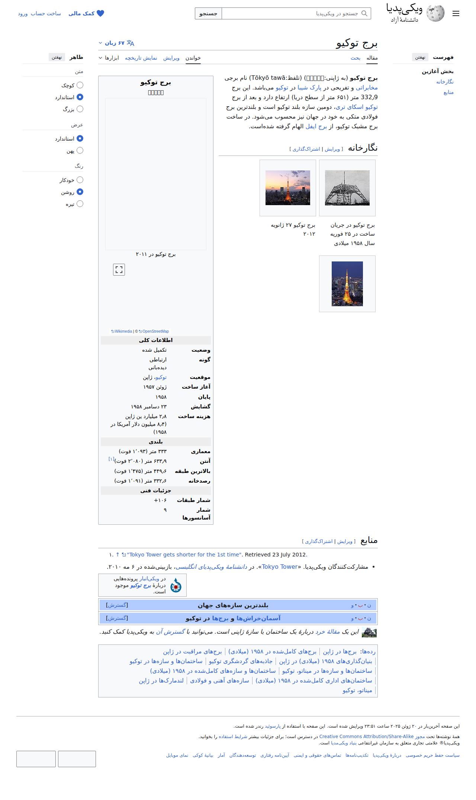

# Visited: https://fa.wikipedia.org/wiki/%D8%A8%D8%B1%D8%AC_%D8%AA%D9%88%DA%A9%DB%8C%D9%88
**Time:** Sun May 10 02:39:45 UTC 2026

## Screenshot

## Raw HTML
[page.html](./page.html)

## Downloaded Media (15 files)
## Downloaded Media Files

## Other Links
- [#](#)
- [#bodyContent](#bodyContent)
- [#cite_note-english.kyodonews.jp-1](#cite_note-english.kyodonews.jp-1)
- [#cite_ref-english.kyodonews.jp_1-0](#cite_ref-english.kyodonews.jp_1-0)
- [#منابع](#منابع)
- [#نگارخانه](#نگارخانه)
- [./رده:برج‌ها_در_ژاپن#توکیو](./رده:برج‌ها_در_ژاپن#توکیو)
- [./رده:برج‌های_مراقبت_در_ژاپن](./رده:برج‌های_مراقبت_در_ژاپن)
- [./رده:برج‌های_کامل‌شده_در_۱۹۵۸_(میلادی)](./رده:برج‌های_کامل‌شده_در_۱۹۵۸_(میلادی))
- [./رده:بنیان‌گذاری‌های_۱۹۵۸_(میلادی)_در_ژاپن](./رده:بنیان‌گذاری‌های_۱۹۵۸_(میلادی)_در_ژاپن)
- [./رده:جاذبه‌های_گردشگری_توکیو](./رده:جاذبه‌های_گردشگری_توکیو)
- [./رده:ساختمان‌ها_و_سازه‌ها_در_توکیو](./رده:ساختمان‌ها_و_سازه‌ها_در_توکیو)
- [./رده:ساختمان‌ها_و_سازه‌ها_در_میناتو،_توکیو](./رده:ساختمان‌ها_و_سازه‌ها_در_میناتو،_توکیو)
- [./رده:ساختمان‌ها_و_سازه‌های_کامل‌شده_در_۱۹۵۸_(میلادی)](./رده:ساختمان‌ها_و_سازه‌های_کامل‌شده_در_۱۹۵۸_(میلادی))
- [./رده:ساختمان‌های_اداری_کامل‌شده_در_۱۹۵۸_(میلادی)](./رده:ساختمان‌های_اداری_کامل‌شده_در_۱۹۵۸_(میلادی))
- [./رده:سازه‌های_آهنی_و_فولادی](./رده:سازه‌های_آهنی_و_فولادی)
- [./رده:صفحه‌هایی_که_از_جعبه_اطلاعات_ساختمان_با_پارامترهای_نامعلوم_استفاده_می‌کنند#coordinates_displayبرج%20توکیو](./رده:صفحه‌هایی_که_از_جعبه_اطلاعات_ساختمان_با_پارامترهای_نامعلوم_استفاده_می‌کنند#coordinates_displayبرج%20توکیو)
- [./رده:صفحه‌هایی_که_از_جعبه_اطلاعات_ساختمان_با_پارامترهای_نامعلوم_استفاده_می‌کنند#iso_regionبرج%20توکیو](./رده:صفحه‌هایی_که_از_جعبه_اطلاعات_ساختمان_با_پارامترهای_نامعلوم_استفاده_می‌کنند#iso_regionبرج%20توکیو)
- [./رده:صفحه‌هایی_که_از_جعبه_اطلاعات_ساختمان_با_پارامترهای_نامعلوم_استفاده_می‌کنند#latNSبرج%20توکیو](./رده:صفحه‌هایی_که_از_جعبه_اطلاعات_ساختمان_با_پارامترهای_نامعلوم_استفاده_می‌کنند#latNSبرج%20توکیو)
- [./رده:صفحه‌هایی_که_از_جعبه_اطلاعات_ساختمان_با_پارامترهای_نامعلوم_استفاده_می‌کنند#latdبرج%20توکیو](./رده:صفحه‌هایی_که_از_جعبه_اطلاعات_ساختمان_با_پارامترهای_نامعلوم_استفاده_می‌کنند#latdبرج%20توکیو)
- [./رده:صفحه‌هایی_که_از_جعبه_اطلاعات_ساختمان_با_پارامترهای_نامعلوم_استفاده_می‌کنند#latmبرج%20توکیو](./رده:صفحه‌هایی_که_از_جعبه_اطلاعات_ساختمان_با_پارامترهای_نامعلوم_استفاده_می‌کنند#latmبرج%20توکیو)
- [./رده:صفحه‌هایی_که_از_جعبه_اطلاعات_ساختمان_با_پارامترهای_نامعلوم_استفاده_می‌کنند#latsبرج%20توکیو](./رده:صفحه‌هایی_که_از_جعبه_اطلاعات_ساختمان_با_پارامترهای_نامعلوم_استفاده_می‌کنند#latsبرج%20توکیو)
- [./رده:صفحه‌هایی_که_از_جعبه_اطلاعات_ساختمان_با_پارامترهای_نامعلوم_استفاده_می‌کنند#longEWبرج%20توکیو](./رده:صفحه‌هایی_که_از_جعبه_اطلاعات_ساختمان_با_پارامترهای_نامعلوم_استفاده_می‌کنند#longEWبرج%20توکیو)
- [./رده:صفحه‌هایی_که_از_جعبه_اطلاعات_ساختمان_با_پارامترهای_نامعلوم_استفاده_می‌کنند#longdبرج%20توکیو](./رده:صفحه‌هایی_که_از_جعبه_اطلاعات_ساختمان_با_پارامترهای_نامعلوم_استفاده_می‌کنند#longdبرج%20توکیو)
- [./رده:صفحه‌هایی_که_از_جعبه_اطلاعات_ساختمان_با_پارامترهای_نامعلوم_استفاده_می‌کنند#longmبرج%20توکیو](./رده:صفحه‌هایی_که_از_جعبه_اطلاعات_ساختمان_با_پارامترهای_نامعلوم_استفاده_می‌کنند#longmبرج%20توکیو)
- [./رده:صفحه‌هایی_که_از_جعبه_اطلاعات_ساختمان_با_پارامترهای_نامعلوم_استفاده_می‌کنند#longsبرج%20توکیو](./رده:صفحه‌هایی_که_از_جعبه_اطلاعات_ساختمان_با_پارامترهای_نامعلوم_استفاده_می‌کنند#longsبرج%20توکیو)
- [./رده:لندمارک‌ها_در_ژاپن](./رده:لندمارک‌ها_در_ژاپن)
- [./رده:مقاله‌های_خرد_ساختمان‌ها_و_سازه‌ها_در_ژاپن](./رده:مقاله‌های_خرد_ساختمان‌ها_و_سازه‌ها_در_ژاپن)
- [./رده:مقاله‌های_دارای_الگوی_یادکرد-ویکی](./رده:مقاله‌های_دارای_الگوی_یادکرد-ویکی)
- [./رده:میناتو،_توکیو](./رده:میناتو،_توکیو)
- [./رده:همه_مقاله‌های_خرد](./رده:همه_مقاله‌های_خرد)
- [./رده:پیوند_رده_انبار_در_ویکی‌داده_است](./رده:پیوند_رده_انبار_در_ویکی‌داده_است)
- [//creativecommons.org/licenses/by-sa/4.0/deed.en](//creativecommons.org/licenses/by-sa/4.0/deed.en)
- [//fa.wikipedia.org/w/api.php?action=rsd](//fa.wikipedia.org/w/api.php?action=rsd)
- [//fa.wikipedia.org/w/index.php?title=%D8%A8%D8%B1%D8%AC_%D8%AA%D9%88%DA%A9%DB%8C%D9%88&amp;action=edit](//fa.wikipedia.org/w/index.php?title=%D8%A8%D8%B1%D8%AC_%D8%AA%D9%88%DA%A9%DB%8C%D9%88&amp;action=edit)
- [//fa.wikipedia.org/w/index.php?title=%D8%A8%D8%B1%D8%AC_%D8%AA%D9%88%DA%A9%DB%8C%D9%88&amp;action=edit&amp;section=1](//fa.wikipedia.org/w/index.php?title=%D8%A8%D8%B1%D8%AC_%D8%AA%D9%88%DA%A9%DB%8C%D9%88&amp;action=edit&amp;section=1)
- [//fa.wikipedia.org/w/index.php?title=%D8%A8%D8%B1%D8%AC_%D8%AA%D9%88%DA%A9%DB%8C%D9%88&amp;action=edit&amp;section=2](//fa.wikipedia.org/w/index.php?title=%D8%A8%D8%B1%D8%AC_%D8%AA%D9%88%DA%A9%DB%8C%D9%88&amp;action=edit&amp;section=2)
- [//fa.wikipedia.org/w/index.php?title=%D8%A8%D8%B1%D8%AC_%D8%AA%D9%88%DA%A9%DB%8C%D9%88&amp;mobileaction=toggle_view_mobile](//fa.wikipedia.org/w/index.php?title=%D8%A8%D8%B1%D8%AC_%D8%AA%D9%88%DA%A9%DB%8C%D9%88&amp;mobileaction=toggle_view_mobile)
- [//fa.wikipedia.org/wiki/%D9%88%DB%8C%DA%A9%DB%8C%E2%80%8C%D9%BE%D8%AF%DB%8C%D8%A7:%D8%AA%D9%85%D8%A7%D8%B3_%D8%A8%D8%A7_%D9%85%D8%A7](//fa.wikipedia.org/wiki/%D9%88%DB%8C%DA%A9%DB%8C%E2%80%8C%D9%BE%D8%AF%DB%8C%D8%A7:%D8%AA%D9%85%D8%A7%D8%B3_%D8%A8%D8%A7_%D9%85%D8%A7)
- [//fa.wikipedia.org/wiki/Acty_Shiodome?action=edit&amp;redlink=1](//fa.wikipedia.org/wiki/Acty_Shiodome?action=edit&amp;redlink=1)
- [//fa.wikipedia.org/wiki/Air_Rise_Tower?action=edit&amp;redlink=1](//fa.wikipedia.org/wiki/Air_Rise_Tower?action=edit&amp;redlink=1)
- [//fa.wikipedia.org/wiki/Akasaka_Biz_Tower?action=edit&amp;redlink=1](//fa.wikipedia.org/wiki/Akasaka_Biz_Tower?action=edit&amp;redlink=1)
- [//fa.wikipedia.org/wiki/Akasaka_Intercity?action=edit&amp;redlink=1](//fa.wikipedia.org/wiki/Akasaka_Intercity?action=edit&amp;redlink=1)
- [//fa.wikipedia.org/wiki/Akasaka_Park_Building?action=edit&amp;redlink=1](//fa.wikipedia.org/wiki/Akasaka_Park_Building?action=edit&amp;redlink=1)
- [//fa.wikipedia.org/wiki/Akasaka_Prince_Hotel?action=edit&amp;redlink=1](//fa.wikipedia.org/wiki/Akasaka_Prince_Hotel?action=edit&amp;redlink=1)
- [//fa.wikipedia.org/wiki/Akasaka_Tower_Residence?action=edit&amp;redlink=1](//fa.wikipedia.org/wiki/Akasaka_Tower_Residence?action=edit&amp;redlink=1)
- [//fa.wikipedia.org/wiki/Akihabara_Dai_Building?action=edit&amp;redlink=1](//fa.wikipedia.org/wiki/Akihabara_Dai_Building?action=edit&amp;redlink=1)
- [//fa.wikipedia.org/wiki/Apple_Tower?action=edit&amp;redlink=1](//fa.wikipedia.org/wiki/Apple_Tower?action=edit&amp;redlink=1)
- [//fa.wikipedia.org/wiki/Ark_Hills_Sengokuyama_Mori_Tower?action=edit&amp;redlink=1](//fa.wikipedia.org/wiki/Ark_Hills_Sengokuyama_Mori_Tower?action=edit&amp;redlink=1)
- [//fa.wikipedia.org/wiki/Ark_Mori_Building?action=edit&amp;redlink=1](//fa.wikipedia.org/wiki/Ark_Mori_Building?action=edit&amp;redlink=1)

## Stats
- Links: 503
- Media: 15
